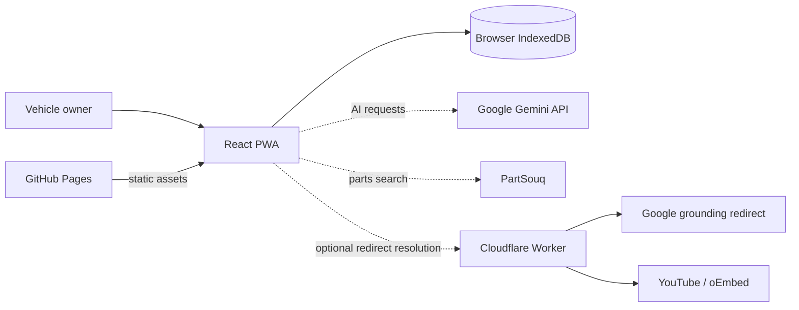
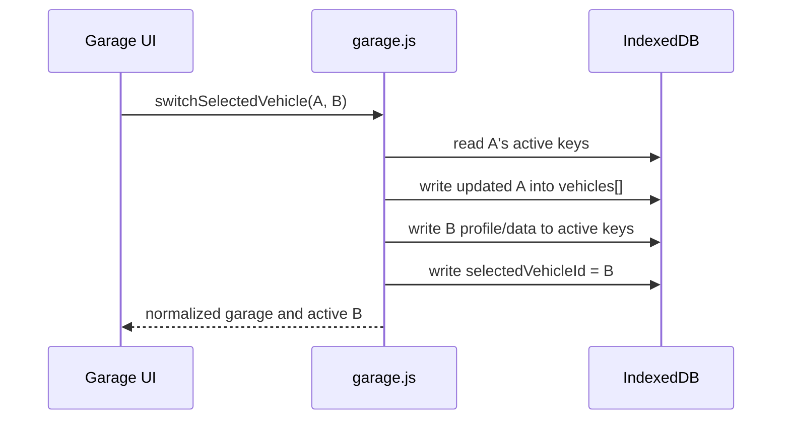
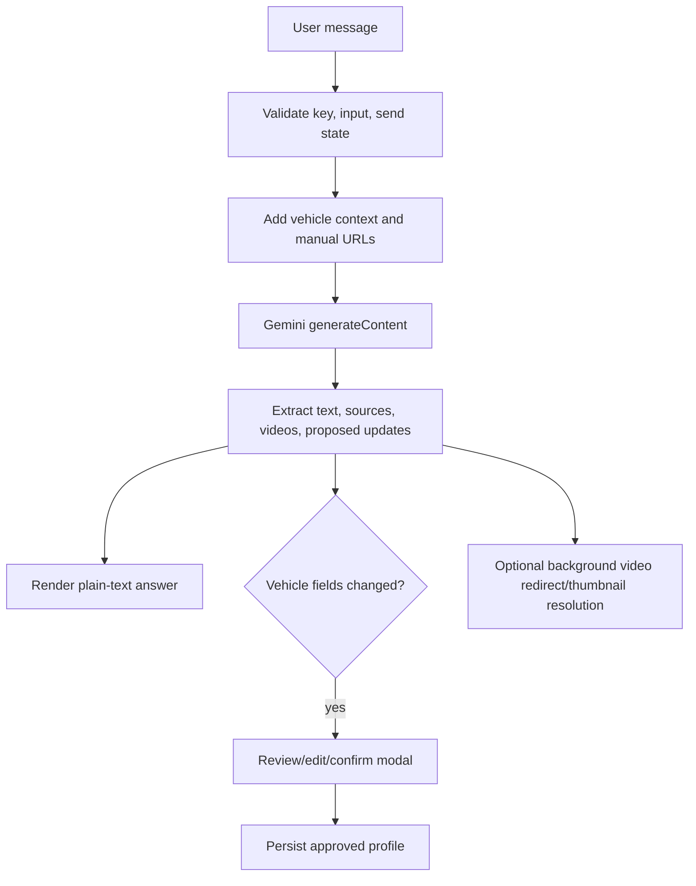

# Technical design

## 1. System context

myOldtimer is primarily a client-side React PWA. GitHub Pages can host the static
bundle. IndexedDB holds application data. The browser calls third parties only for
AI, workshop-manual retrieval through Gemini, parts lookup, and grounded videos.



Solid arrows are core local behavior. Dashed arrows require network access and may
share data with external services.

## 2. Technology and build

| Area | Implementation |
| --- | --- |
| UI | React 19 functional components and hooks |
| Build | Vite 7 with `@vitejs/plugin-react` |
| Routing | React Router 7 |
| Persistence | Custom promise-based IndexedDB key/value wrapper |
| PWA | `vite-plugin-pwa`, auto-updating service worker, Workbox precache |
| Static hosting | GitHub Pages workflow on pushes to `main` |
| Optional edge service | Cloudflare Worker deployed through Wrangler |
| AI | Direct browser calls to Gemini `generateContent` v1beta endpoint |

There is no application server, server database, global state library, schema
library, or test framework in the current repository.

## 3. Repository structure

```text
src/
  App.jsx                 route table, tab navigation, swipe/route transitions
  main.jsx                React bootstrap, router choice, PWA registration
  pages/                  feature-level screens and orchestration
  components/             reusable modals, buttons, image UI
  components/ai/          AI-specific presentation components
  lib/db.js               IndexedDB key/value adapter
  lib/garage.js           multi-vehicle snapshots and active-vehicle switching
  lib/maintenance.js      maintenance normalization and due-state calculations
  lib/checklist.js        checklist normalization and partitioning
  lib/mileage.js          mileage parsing and monotonic synchronization
  lib/ai/                 AI settings, prompts, response parsing, video handling
worker/
  cloudflare-video-resolver.js
.github/workflows/
  deploy-pages.yml
public/                    PWA icons and static assets
graphify-out/              generated dependency graph; ignored by Git
```

The Graphify report groups the code into coherent feature communities: AI,
application/routing, maintenance, garage/vehicle, checklist/shared modals, AI
debug/video handling, and the worker. It reports no import cycles. `dbGet` and
`dbSet` are the highest-connectivity nodes, so persistence changes have the
largest blast radius.

## 4. Routing and navigation

`App.jsx` owns the route table:

| Route | Screen |
| --- | --- |
| `/` | Active vehicle dashboard |
| `/garage` | Vehicle selector |
| `/vehicle` and `/vehicle?new=1` | Edit or add vehicle |
| `/diagnosis`, `/diagnostics` | Diagnostic prototype |
| `/diagnostics/fault-codes` | Simulated scan and current codes |
| `/diagnostics/fault-history` | Detected-code history |
| `/diagnostics/relay-tester` | Simulated relay commands |
| `/maintenance` | Maintenance overview/categories |
| `/maintenance/history` | Maintenance history |
| `/maintenance/replace` | Part replacement history |
| `/checklist` | To-do/completed task workflow |
| `/parts-finder` | VIN-based provider links |
| `/fuel-efficiency` | Refuel log and calculations |
| `/ai` | Gemini assistant |

At a root deployment `main.jsx` uses `BrowserRouter`. When Vite's base URL is a
subpath, it uses `HashRouter`, avoiding GitHub Pages rewrite requirements.

Primary-tab direction is derived from tab order. Browser POP navigation is treated
as backward navigation. The previous and next locations coexist for 280 ms during
the CSS transition. Touch navigation requires at least 64 px horizontal movement
and a horizontal-to-vertical ratio of 1.25.

## 5. Persistence architecture

`lib/db.js` opens IndexedDB database `myoldtimer-db`, version 1, with one object
store named `keyval`. Every row has this physical shape:

```js
{
  key: "maintenanceHistory",
  value: /* arbitrary structured-clone value */,
  updatedAt: "2026-08-07T12:34:56.000Z"
}
```

The adapter exposes `dbGet`, `dbSet`, and `dbDelete`. Feature modules use constants
from `STORAGE_KEYS`; there are no multi-key transactions at the domain level.

### Multi-vehicle compatibility layer

The app evolved from single-vehicle keys to a garage containing snapshots. It now
maintains both:

- a `vehicles` array containing each vehicle's profile, image, mileage, and
  vehicle-owned feature data; and
- “active vehicle” keys such as `vehicleInfo`, `maintenanceHistory`, and
  `checklistData`, which existing pages read directly.



This design minimizes changes to feature pages, but it means consistency depends
on `loadGarage`, `persistActiveVehicleSnapshot`, and `syncCurrentVehicle`. A future
schema should consider making the vehicle ID part of every domain key or using
vehicle-scoped object stores to remove the duplicated active state.

## 6. Domain services

### Maintenance

`maintenance.js` is a pure calculation/normalization module. It determines due
dates and mileages and returns `ok`, `dueSoon`, `overdue`, or `unknown`. For combined
intervals it takes the maximum progress and the most urgent status. History is the
effective source of the last service event; legacy category fields remain as a
fallback.

### Mileage

`mileage.js` provides a cross-feature invariant: a non-negative candidate from a
maintenance entry, replacement, checklist completion, or odometer fuel entry may
raise stored mileage, but never lower it.

### Checklist

`checklist.js` normalizes legacy shapes and partitions tasks based on whether all
subtasks are complete. The page persists the partition after every task/subtask
mutation.

### AI

AI code is split into settings persistence, vehicle context, response processing,
debug logging, and grounded-video resolution. The page remains the orchestrator.



The system prompt limits profile proposals to known fields. Response parsing is
defensive: it accepts direct JSON, fenced JSON, or an embedded first object, maps a
small set of aliases, and discards non-whitelisted fields. Confirmation is the
authorization boundary before a proposal changes local vehicle data.

### Cloudflare video resolver

The worker accepts POST requests containing one URL or a URL array. It only follows
`vertexaisearch.cloud.google.com/.../grounding-api-redirect/` URLs, follows the
redirect with a 12-second timeout, recognizes YouTube URLs, and fetches an oEmbed
title with an 8-second timeout. It supports CORS from any origin and returns JSON
errors for bad methods, payloads, URLs, or upstream failures.

## 7. Data consistency and migrations

Migrations are read-time normalizers rather than a centralized versioned migration
pipeline. Current examples include:

- converting legacy single-vehicle active keys into the first garage record;
- adding defaults to incomplete vehicle records;
- resolving maintenance category names to category IDs;
- converting legacy replacement `category/categories` fields to `parts`;
- converting legacy completed checklist records into completed subtasks;
- converting legacy fuel entries into trip-mode entries.

The IndexedDB version remains 1 because logical schemas live inside the value
objects. This is flexible, but migration coverage must be tested whenever stored
shapes change.

## 8. Design constraints and extension points

- **Persistence is a shared dependency.** Add schema validation and failure
  handling before substantially expanding the data model.
- **Pages own substantial orchestration.** `AIChat`, `Checklist`, `Maintenance`,
  and `FuelEfficiency` are natural candidates for hooks/reducers as they grow.
- **There is no error boundary.** A rejected database promise outside local
  handling can surface as a broken interaction.
- **PWA cache scope is the build base path.** New asset types need corresponding
  Workbox patterns if they should be precached.
- **External integrations should remain adapters.** A real diagnostic transport,
  additional parts providers, or an AI proxy should sit behind explicit interfaces
  rather than be embedded in page components.
